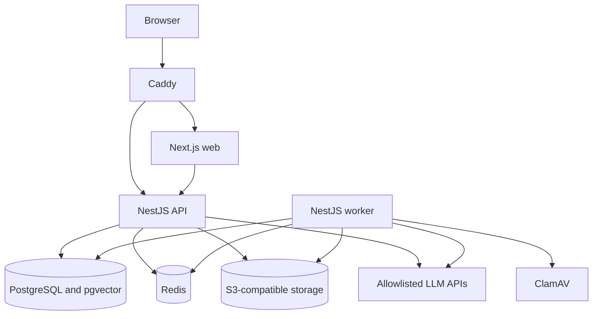

# Containers

```mermaid
flowchart TB
  browser[Browser]
  caddy[Caddy]
  web[Next.js web]
  api[NestJS API]
  worker[NestJS worker]
  pg[(PostgreSQL and pgvector)]
  redis[(Redis)]
  s3[(S3-compatible storage)]
  clam[ClamAV]
  provider[Allowlisted LLM APIs]

  browser --> caddy
  caddy --> web
  caddy --> api
  web --> api
  api --> pg
  api --> redis
  api --> s3
  api --> provider
  worker --> pg
  worker --> redis
  worker --> s3
  worker --> clam
  worker --> provider
```

The browser uploads file bytes to object storage with a presigned URL. The API does not proxy those bytes.
