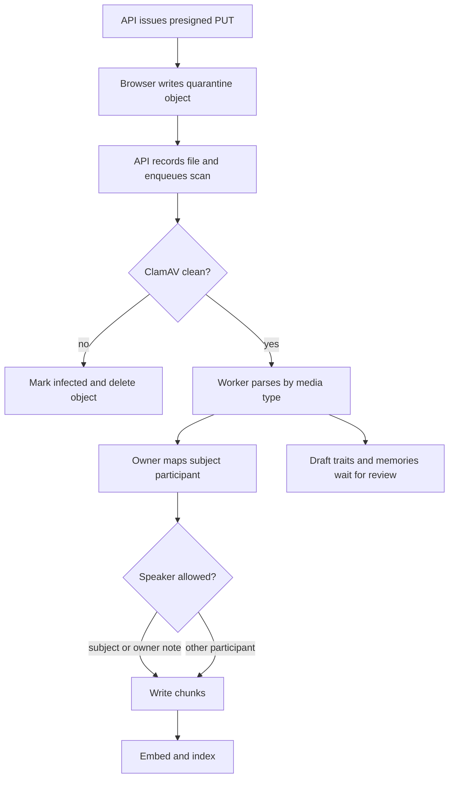

# Ingestion flow

```mermaid
flowchart TD
  presign[API issues presigned PUT]
  put[Browser writes quarantine object]
  complete[API records file and enqueues scan]
  scan{ClamAV clean?}
  reject[Mark infected and delete object]
  parse[Worker parses by media type]
  map[Owner maps subject participant]
  gate{Speaker allowed?}
  chunk[Write chunks]
  embed[Embed and index]
  review[Draft traits and memories wait for review]

  presign --> put --> complete --> scan
  scan -->|no| reject
  scan -->|yes| parse --> map --> gate
  gate -->|subject or owner note| chunk --> embed
  gate -->|other participant| chunk
  parse --> review
```

Chunks for other participants are stored with `retrieval_allowed = false` and are not embedded.
